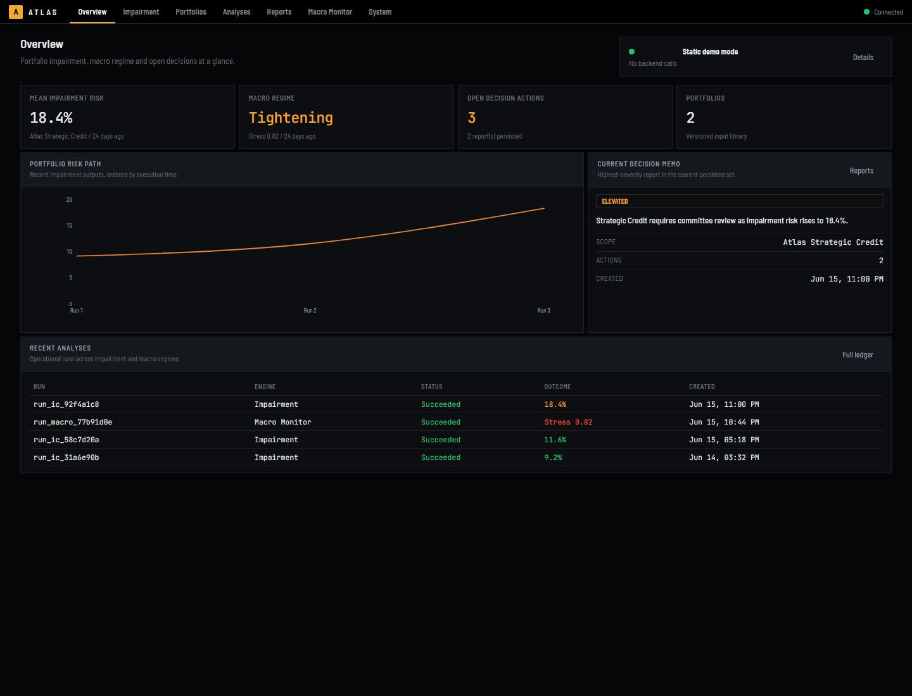
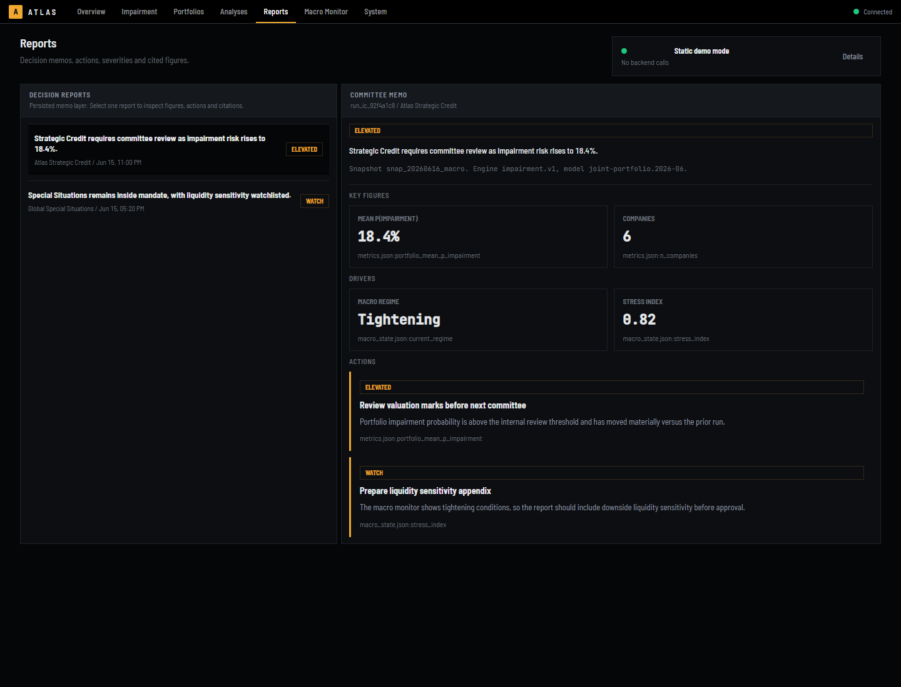
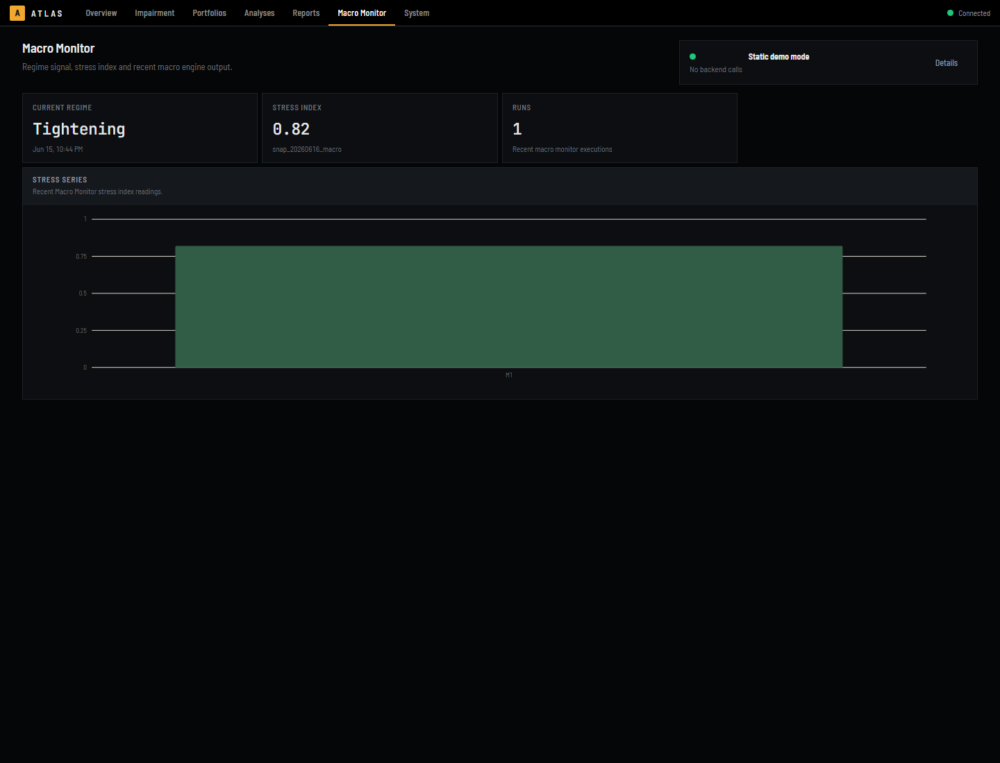
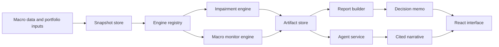
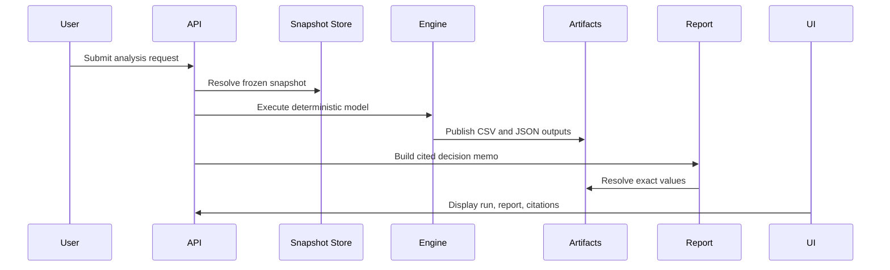
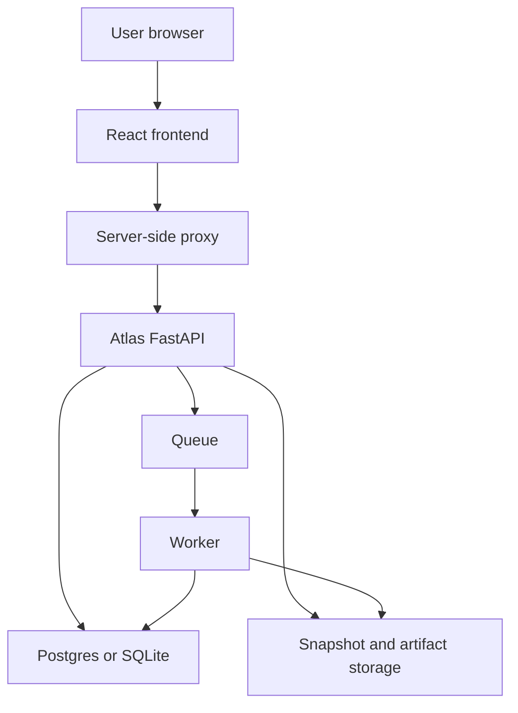

# AtlasOS

> Macro-financial monitoring for reproducible portfolio risk, audited decisions, and cited institutional reports.


AtlasOS is an institutional macro-financial monitoring platform. It turns
frozen macro snapshots and portfolio inputs into deterministic risk analyses,
decision reports, and traceable narratives. The system is designed around one
operating rule: every number must be reproducible, every claim must cite its
source, and every decision must leave an audit trail.

## Product Screenshots

### Executive Overview



### Decision Reports



### Macro Monitor



## What AtlasOS Does

AtlasOS combines deterministic quantitative engines with a governed reporting
layer. The LLM, when enabled, does not calculate figures. It can plan and
narrate, but every numeric output comes from the engine artifacts and every
numeric claim is citation-checked before it reaches the user.

| Capability | Description |
| --- | --- |
| Portfolio impairment analysis | Joint portfolio impairment simulation with macro, sector, company, and valuation multiple factors. |
| Macro monitor | Current regime, stress index, indicator trends, alerts, and state-conditioned reference scenarios. |
| Decision reports | Persisted institutional memos with severities, actions, drivers, figures, and citations. |
| Cited narratives | Optional LLM-generated explanations constrained to citable engine values. |
| Audit trail | Snapshot hashes, artifacts, API runs, reports, and agent traces are persisted. |
| Graceful degradation | With no LLM key, AtlasOS still runs deterministic engines and cited template narratives. |

## Operating Principles

1. Deterministic engines produce all figures.
2. The LLM never performs calculations.
3. Analyses run on identified, hash-verified snapshots.
4. Reports cite exact artifact values, not vague sources.
5. Narration failure never blocks the underlying numbers.
6. Published validation results are shown as measured, including limitations.

## System Architecture



AtlasOS separates platform infrastructure, domain engines, agent orchestration,
and user interfaces:

| Layer | Responsibility |
| --- | --- |
| `atlas.platform` | Contracts, snapshots, artifacts, database models, settings, queue, and execution runtime. |
| `atlas.domain` | Macro ingestion, impairment engine, macro monitor, validation, and report models. |
| `atlas.agent` | Planning, narration, citation validation, LLM abstraction, and trace storage. |
| `atlas.interfaces` | FastAPI application, API-key auth, CLI operations, worker process, and static UI hosting. |
| `frontend` | React/Vite institutional interface and server-side deployment proxy. |

## Analysis Lifecycle



## Validation and Evidence

AtlasOS includes a reproducible validation workflow for the macro crisis
classifier and model benchmarks. The current validation report covers
walk-forward testing, target sensitivity, probability calibration, false-alert
burden, and feature influence.

| Artifact | Location |
| --- | --- |
| Validation report | [`docs/validation_report.md`](docs/validation_report.md) |
| Agent eval record | [`docs/agent_evals.md`](docs/agent_evals.md) |
| Architecture decisions | [`docs/DECISIONS.md`](docs/DECISIONS.md) |
| Known limitations | [`docs/limitations.md`](docs/limitations.md) |

### Model Evidence


## Security and Governance

AtlasOS is built for a controlled institutional environment:

| Control | Implementation |
| --- | --- |
| API authentication | API keys with read and run scopes. Plaintext tokens are shown once and stored as hashes. |
| Server-side secrets | Browser clients do not store Atlas API keys. Vercel deployments use a server-side proxy. |
| Request hardening | Security headers, maximum body size, and dependency-free rate limiting are included. |
| Data integrity | Snapshots use content identity and parquet-byte integrity checks. |
| Traceability | Runs, reports, artifacts, and agent traces are persisted for later review. |
| LLM containment | LLM clients receive capability catalogs and citable values, not raw snapshot tables. |

Browser authentication has two supported paths. A Vercel deployment calls the
same-origin `/api/atlas/*` proxy, which injects its server-side API key. An
explicit local demo bootstrap issues an `HttpOnly`, `SameSite=Strict` cookie;
the plaintext key is never returned to JavaScript. Direct API clients continue
to authenticate with `X-API-Key`.

## Deployment Model

AtlasOS can run as a local evaluation instance, a containerized backend with
Postgres and Redis, or a split deployment where the frontend is served separately
and calls the Atlas API through a server-side proxy.



For operators, the repository includes Docker, Alembic migrations, API-key
management, a Redis worker mode, and a local SQLite mode for lightweight
evaluation. Detailed operational commands live in the source tree and project
documentation instead of this public overview.

## API Surface

| Area | Endpoints |
| --- | --- |
| Portfolios | `POST /portfolios`, `GET /portfolios`, `GET /portfolios/{id}`, `PUT /portfolios/{id}` |
| Analyses | `POST /analyses`, `GET /analyses`, `GET /analyses/{id}` |
| Reports | `POST /analyses/{id}/report`, `GET /analyses/{id}/report`, `GET /reports` |
| Agent | `POST /agent/ask`, `GET /agent/traces/{id}` |
| Artifacts | `GET /artifacts/{run_id}/{name}` |
| System | `GET /health` |

## Repository Guide

```text
src/atlas/
  platform/      Contracts, snapshots, database, queue, runtime
  domain/        Data ingestion, engines, validation, reports
  agent/         Planning, narration, citations, evals, traces
  interfaces/    FastAPI app, worker, CLI, static UI hosting
frontend/        React/Vite interface and deployment proxy
migrations/      Alembic database migrations
docs/            Decisions, validation, limitations, figures
tests/           Contracts, API, engines, reports, agent, citations
```

## Roadmap

| Track | Status |
| --- | --- |
| Deterministic engine foundation | Complete |
| FastAPI, persistence, auth, queue | Complete |
| FRED ingestion and model validation | Complete |
| Governed agent with cited narratives | Complete |
| Macro monitor | Complete |
| Public proof and hosted user experience | In progress |

## Limitations

AtlasOS is intentionally transparent about what it does not yet claim. Current
limitations include revised FRED history rather than vintage ALFRED data,
monthly crisis-detection granularity, on-demand alerts rather than automatic
delivery, market-multiple valuation rather than a full DCF stack, and single
tenant operation. See [`docs/limitations.md`](docs/limitations.md) for the full
record.

## License

No open-source license has been published for this repository yet. Until a
`LICENSE` file is added, all rights are reserved by the repository owner. Before
using AtlasOS outside evaluation or review, confirm the intended commercial or
open-source license.

## Disclaimer

AtlasOS is analytical software. It does not provide investment, accounting,
legal, tax, or risk-management advice. Outputs should be reviewed by qualified
professionals before they are used in investment, valuation, reporting, or
committee decisions.
