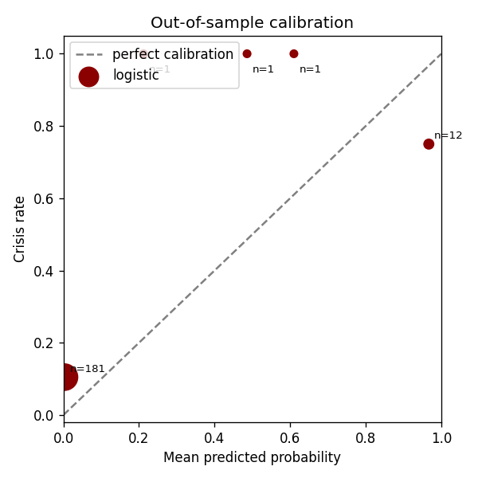
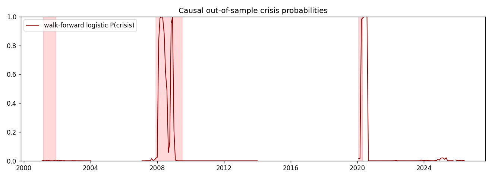

# Model Validation Report - Causal Crisis Classifier

*Generated by `scripts/validation_report.py`. The headline results are expanding
walk-forward tests; no model parameter or threshold is fitted on a test period.
Section 1 pools all folds — section 2 reports each episode separately and is the
table to read for detection skill.*

| | |
|---|---|
| Snapshot | `snap_f7658448791f0610` |
| Data period | 1990-01-31 to 2026-06-30 (monthly) |
| Data source | Revised FRED history (provisional development run) |
| Primary target | Strict NBER recession months, contemporaneous detection |
| Primary model | Causal logistic score with fixed VIX stress override |
| Operating rule | Maximize training precision subject to at least 60% training recall |

## 1. Primary out-of-sample comparison

All models below are scored on the same walk-forward test months. HMM and
logistic thresholds are selected only from each fold's training history.

| model | precision | recall | f1 | pr_auc | brier | false_alerts_per_year |
|---|---|---|---|---|---|---|
| hybrid | 0.556 | 0.645 | 0.597 | 0.686 | 0.095 | 0.941 |
| logistic | 0.786 | 0.355 | 0.489 | 0.515 | 0.115 | 0.176 |
| hmm | 0.108 | 0.387 | 0.169 | 0.120 | 0.476 | 5.824 |
| vix_rule | 0.464 | 0.419 | 0.441 | 0.441 | 0.168 | 0.882 |
| spread_rule | 0.385 | 0.645 | 0.482 | 0.371 | 0.218 | 1.882 |

`false_alerts_per_year` is the operational false-positive burden. `pr_auc` is
preferred over overall accuracy because crisis months are rare. The Brier score
measures probability quality; lower is better.

**These figures pool every fold's test months into one sample.** Pooling hides
which episodes the model actually caught, and the episodes are not
interchangeable. Read section 2 before quoting anything here.

## 2. Walk-forward folds

Per-fold results for the headline model and the logistic baseline. The `model`
column is explicit: these rows are not a decomposition of a single row above.

| fold | model | precision | recall | f1 | crisis_months | false_alerts_per_year |
|---|---|---|---|---|---|---|
| covid | hybrid | 0.333 | 0.667 | 0.444 | 3 | 1.333 |
| covid | logistic | 0.400 | 0.667 | 0.500 | 3 | 1.000 |
| dotcom | hybrid | 0.250 | 0.222 | 0.235 | 9 | 2.000 |
| dotcom | logistic | 0.000 | 0.000 | 0.000 | 9 | 0.000 |
| euro_stress | hybrid | 0.000 | 0.000 | 0.000 | 0 | 1.333 |
| euro_stress | logistic | 0.000 | 0.000 | 0.000 | 0 | 0.000 |
| gfc | hybrid | 0.941 | 0.842 | 0.889 | 19 | 0.250 |
| gfc | logistic | 1.000 | 0.474 | 0.643 | 19 | 0.000 |
| recent | hybrid | 0.000 | 0.000 | 0.000 | 0 | 0.250 |
| recent | logistic | 0.000 | 0.000 | 0.000 | 0 | 0.000 |

Folds cover dot-com, GFC, 2011 stress, COVID and the recent post-COVID period.

Only 3 of 5 folds contain labeled crisis months under the strict NBER target. `euro_stress`, `recent` contain none, so their precision and recall are undefined rather than zero — only their false-alert burden is meaningful.

Of the 3 scorable folds, the hybrid model detects at least one crisis month in `covid`, `dotcom`, `gfc` and misses none entirely. `gfc` supplies 19 of the 31 pooled crisis months, so the aggregate in section 1 is largely a statement about that single episode. With this few independent events, treat all three-decimal figures in this report as indicative, not precise.

## 3. Detection lag

- Crisis starting 2001-03: detected after **6 month(s)**
- Crisis starting 2007-12: detected after **1 month(s)**
- Crisis starting 2020-02: detected after **1 month(s)**

Detection is monthly. A zero-month result means the model crossed its
training-selected threshold during the first labeled crisis month.

## 4. Probability calibration

| probability bin | observations | mean_probability | crisis_rate |
|---|---|---|---|
| (-0.001, 0.2] | 152.000 | 0.008 | 0.053 |
| (0.2, 0.4] | 12.000 | 0.277 | 0.333 |
| (0.4, 0.6] | 9.000 | 0.493 | 0.333 |
| (0.6, 0.8] | 6.000 | 0.667 | 0.333 |
| (0.8, 1.0] | 18.000 | 0.967 | 0.778 |

## 5. Target-definition sensitivity

| target | precision | recall | f1 | pr_auc | brier | false_alerts_per_year |
|---|---|---|---|---|---|---|
| strict_nber | 0.556 | 0.645 | 0.597 | 0.686 | 0.095 | 0.941 |
| broader_stress | 0.738 | 0.633 | 0.681 | 0.750 | 0.123 | 0.647 |

`strict_nber` is the primary benchmark. `broader_stress` includes extended
credit-stress periods and 2011. Publishing both prevents label choices from
being mistaken for model improvement.

## 6. Most influential standardized features

| feature | mean_abs_coef |
|---|---|
| fed_funds_chg6 | 1.293 |
| baa_aaa_spread | 1.120 |
| unemployment | 0.980 |
| fed_funds_chg3 | 0.796 |
| cpi_yoy | 0.734 |
| baa_aaa_spread_chg1 | 0.643 |
| vix | 0.631 |
| t10y2y_chg6 | 0.626 |
| unemployment_chg6 | 0.563 |
| hmm_crisis | 0.540 |

These are mean absolute coefficients across folds. They describe model use, not
causal economic importance.

## 7. Temporal controls

- CPI and unemployment are delayed by one month in the backtest.
- Every feature is backward-looking.
- Standardization, HMM fitting, logistic fitting and threshold selection happen
  inside each training fold.
- No model parameter or threshold is *fitted* on a test period.
- The VIX override levels (25/30/40)
  and the credit-spread rule are fixed constants, not fold-fitted values. They
  were nonetheless chosen by an author who has seen the full history, so the
  hybrid and the two rule baselines carry hindsight that the logistic model does
  not. The logistic row is the cleaner out-of-sample claim.
- This provisional run uses revised FRED history. Set `ATLAS_VALIDATION_DATA_SOURCE=alfred` with `ATLAS_FRED_API_KEY` before treating the metrics as release evidence.

## 8. Crisis probabilities

## 9. Impairment shock sensitivity

P(impairment) for a reference company under a stressed regime mix, varying the
crisis EBITDA shock:

|  | sigma=0.1 | sigma=0.2 | sigma=0.3 |
|---|---|---|---|
| mu=-0.25 | 0.582 | 0.525 | 0.477 |
| mu=-0.15 | 0.536 | 0.457 | 0.420 |
| mu=-0.05 | 0.388 | 0.364 | 0.357 |

Production crisis values remain calibrated from corporate-profit history:
mu=-0.021, sigma=0.184. This calibration
is separate from crisis-classifier validation.

## 10. Interpretation

- The hybrid classifier combines the calibrated logistic score with a fixed,
  causal VIX stress override. HMM remains a feature and benchmark.
- Episode-level detection (section 2) is the honest read of skill. The pooled
  aggregate in section 1 is reported for baseline comparison, not as a summary
  of how the model behaves on a new crisis.
- This report does not claim deployable forecasting skill. It establishes a
  leakage-controlled baseline that future feature and model changes must beat.
