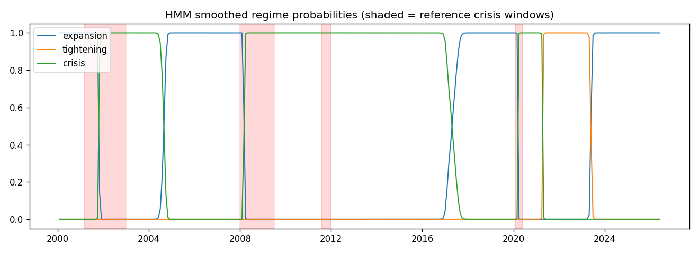
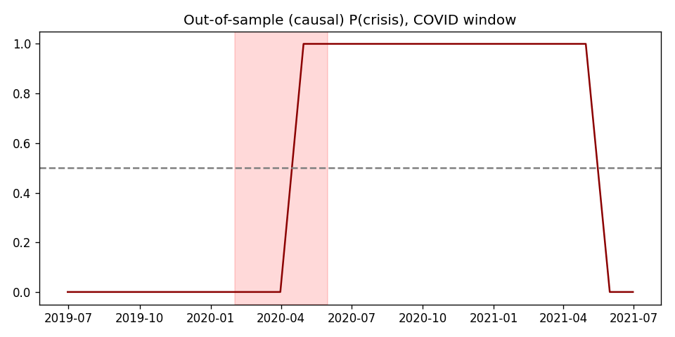

# Model Validation Report — HMM regime classifier

*Generated by `scripts/validation_report.py` (versioned; `make validation-report`
regenerates byte-comparable numbers from the same snapshot).*

| | |
|---|---|
| Snapshot | `snap_6f94201ca0f2ebe4` |
| Data period | 1990-01-31 → 2026-05-31 (monthly) |
| Model | 3-state diagonal-Gaussian HMM, `hmm3-mc-0.2` |
| Evaluation window | 2000-01 → 2026-05-31 |

Reference labels are NBER recessions plus Fed hiking cycles (see
`atlas/domain/validation/labels.py` for the exact windows and rationale).
**Monthly data bounds detection-lag resolution at one month** — daily-frequency
detection is future work (docs/limitations.md).

## 1. Confusion matrix — full sample (smoothed), 2000→present

Rows = reference label, columns = model prediction, values = months.

| label \\ pred | expansion | tightening | crisis |
|---|---|---|---|
| expansion | 74 | 11 | 113 |
| tightening | 51 | 14 | 4 |
| crisis | 10 | 0 | 39 |

Accuracy: **40.2%** (z-score baseline from Phase 0: 49.4%).

## 2. Detection lag per crisis window

- Crisis starting 2001-03: detected after **7 month(s)**
- Crisis starting 2008-01: detected after **2 month(s)**
- Crisis starting 2011-08: detected after **0 month(s)**
- Crisis starting 2020-02: detected after **1 month(s)**

Out-of-sample causal detection of COVID (2020-02): **2 month(s)**.

## 3. Out-of-sample — train 2010–2018, evaluate 2019–2024 (causal)

| label \\ pred | expansion | tightening | crisis |
|---|---|---|---|
| expansion | 11 | 27 | 11 |
| tightening | 3 | 16 | 0 |
| crisis | 0 | 2 | 2 |

Out-of-sample accuracy: **40.3%**.

## 4. Naive benchmark comparison (crisis detection, 2000→present)

|  | precision | recall |
|---|---|---|
| HMM (smoothed argmax) | 0.250 | 0.796 |
| VIX > 30 | 0.786 | 0.449 |
| BAA-AAA spread > 1.2pp | 0.627 | 0.755 |

## 5. Sensitivity — crisis EBITDA shock parameters

P(impairment) for a reference company (EBITDA 100, multiple 8.0, carrying
value 780) under a stressed regime mix (P(crisis)=0.5 — today's P(crisis) is
near zero, which would make the grid flat), varying the crisis shock:

|  | sigma=0.1 | sigma=0.2 | sigma=0.3 |
|---|---|---|---|
| mu=-0.25 | 0.656 | 0.599 | 0.551 |
| mu=-0.15 | 0.611 | 0.531 | 0.494 |
| mu=-0.05 | 0.462 | 0.439 | 0.431 |

The production values (mu=-0.15, sigma=0.2) sit in the
middle of this grid. They remain literature-informed placeholders pending
historical calibration (PRD Q2 — still open; tracked in DECISIONS.md).

## 6. Figures

## 7. Honest read

- The HMM is compared against trivially simple rules in §4 on purpose; where a
  naive rule wins on a metric, that is reported, not hidden.
- The model's characteristic failure is **over-predicting crisis during
  post-recession credit normalization** (2003, 2009-10, 2015-16): spreads stay
  wide after the acute phase ends, so recall is high (39/49 crisis
  months caught) but precision is low. For an impairment *monitoring* system a
  conservative bias is the preferable failure direction, but it is a bias.
  Candidate fix (parking lot): spread *change* rather than level as a feature.
- Labels in 2011 and 2022 are judgment calls (not NBER); accuracy there
  measures agreement with our labeling, not truth.
- Smoothed probabilities (§1) use future data and overstate real-time skill;
  the causal numbers in §2-3 are the ones that matter for operation.
